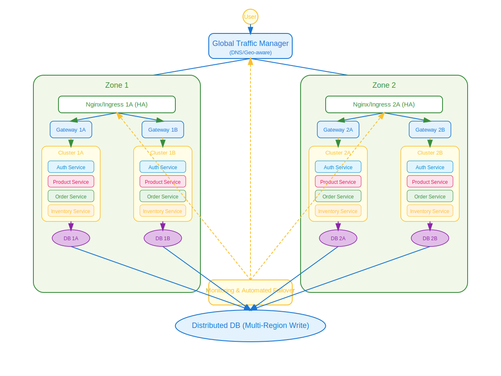

# Multi-Application, Multi-Region Cluster Architecture

This document describes a highly available, scalable, and resilient architecture for deploying multiple microservices across geographically distributed zones and clusters. The design ensures business continuity, low latency, and automated failover for critical applications.

---

## Architecture Overview

### Key Components

- **Global Traffic Manager (GTM):**  
  A DNS/Geo-aware service that routes user requests to the healthiest and closest region, ensuring optimal latency and availability.

- **Zones & Clusters:**  
  - **Zone 1:** Cluster 1A, Cluster 1B  
  - **Zone 2:** Cluster 2A, Cluster 2B  
  Each cluster hosts all core applications for redundancy and load distribution.

- **High-Availability Load Balancers (Nginx/Ingress):**  
  Each zone uses HA Nginx/Ingress pairs to distribute traffic to gateway instances within the zone.

- **Gateways:**  
  Gateways handle routing, authentication, and authorization, and direct requests to the appropriate microservice within the cluster.

- **Microservices (per cluster):**  
  - Auth Service  
  - Product Service  
  - Order Service  
  - Inventory Service  

- **Databases:**  
  Each cluster has a local database instance. All databases are part of a distributed, multi-region write-capable database layer for consistency and disaster recovery.

- **Monitoring & Automated Failover:**  
  Centralized observability continuously monitors health and performance, triggering automated failover and updating routing as needed.

---

## Features

- **High Availability:**  
  All applications are deployed in every cluster, ensuring no single point of failure.

- **Geo-Distributed:**  
  Users are routed to the nearest healthy region for low latency and compliance.

- **Automated Failover:**  
  Health checks and monitoring enable automatic rerouting of traffic in case of failures at the cluster or zone level.

- **Scalability:**  
  Easily add more clusters, zones, or microservices as business needs grow.

- **Consistency & Disaster Recovery:**  
  Distributed database layer ensures data consistency and rapid recovery from failures.

---

## Failover Strategy

1. **Cluster Failover (Within a Zone):**  
   If a cluster fails, Nginx/Ingress reroutes traffic to another healthy cluster in the same zone.

2. **Zone/Region Failover:**  
   If an entire zone fails, the GTM redirects traffic to another healthy zone.

3. **Automated Monitoring:**  
   Observability tools detect failures and update routing configurations automatically.

---

## How to Use This Architecture

1. **Deploy all core microservices in every cluster.**
2. **Configure GTM for geo-aware routing and health checks.**
3. **Set up HA Nginx/Ingress in each zone.**
4. **Implement distributed database replication and failover.**
5. **Integrate centralized monitoring and alerting.**

---

## Diagram Legend

- **Blue:** Traffic management and routing components  
- **Green:** Zones and clusters  
- **Yellow:** Applications and gateways  
- **Purple:** Databases  
- **Orange:** Monitoring and observability

---

## Extending the Architecture

- Easy to add more microservices as needed.
- Integration with CI/CD pipelines for automated deployments.
- Use service mesh for advanced traffic management and security.
- Enhance observability with distributed tracing and log aggregation.

---
